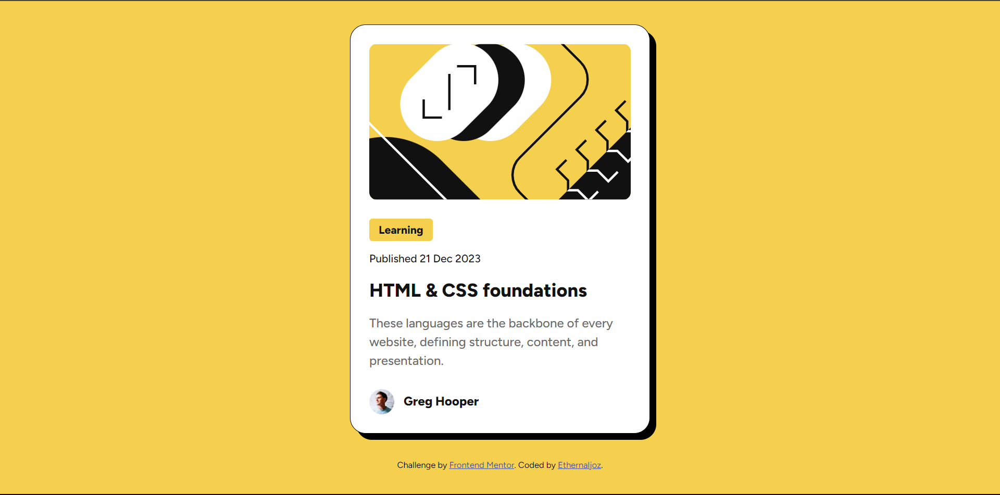

# Frontend Mentor - Blog preview card solution

This is a solution to the [Blog preview card challenge on Frontend Mentor](https://www.frontendmentor.io/challenges/blog-preview-card-ckPaj01IcS). Frontend Mentor challenges help you improve your coding skills by building realistic projects. 

## Table of contents

- [Overview](#overview)
  - [Screenshot](#screenshot)
  - [Links](#links)
- [My process](#my-process)
  - [Built with](#built-with)
  - [What I learned](#what-i-learned)
  - [Continued development](#continued-development)
- [Author](#author)

## Overview

### Screenshot

### Links

- Solution URL: [my solution URL 😁](https://github.com/Ethernaljoz/frontend-mentor-coding-challenges/tree/main/02.%20blog-preview-card-main)
- Live Site URL: [my live site URL 😁 ](https://blog-preview-card-main-ethernaljoz.vercel.app/)

## My process

### Built with

- Semantic HTML5 markup
- CSS custom properties
- Flexbox

### What I learned

I learned how to create this Blog preview card with css flexboxes using the appropriate css properties for this challenge.

### Continued development

For future projects I'd like to do more responsive to improve my responsive design and create more complex things. 

## Author

- Frontend Mentor - [@Ethernaljoz](https://www.frontendmentor.io/profile/Ethernaljoz)
- Github - [@Ethernaljoz](https://github.com/Ethernaljoz)
